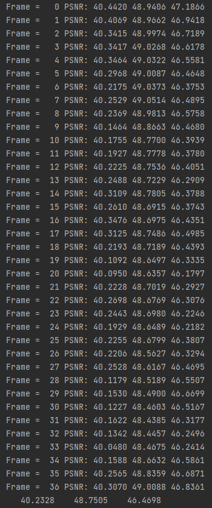
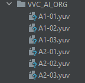
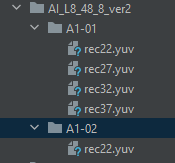

## Overview
This is a PSNR calculation for 10-bit YUV of ["Low-Complexity Intra Coding in Versatile Video Coding"]( https://ieeexplore.ieee.org/document/9690615), a deep learning based 10-bit image Super-Resolution model.
This repo also provide PSNR calculation for 8-bit image.

## Sample result



## Requirements

python >= 3.6


## Apply to your own image
 
Execute **10bit_eval.py** to generate PSNR result for 10-bit YUV.

First, you need to set HR orginal data at **org_dir**, which is arranged as below:



The YUV which is needed to calculate PSNR set in **target_dir**, which is shown as below:




```
python .\10bit_eval.py
```

Run the code and record data manually 1by1.

